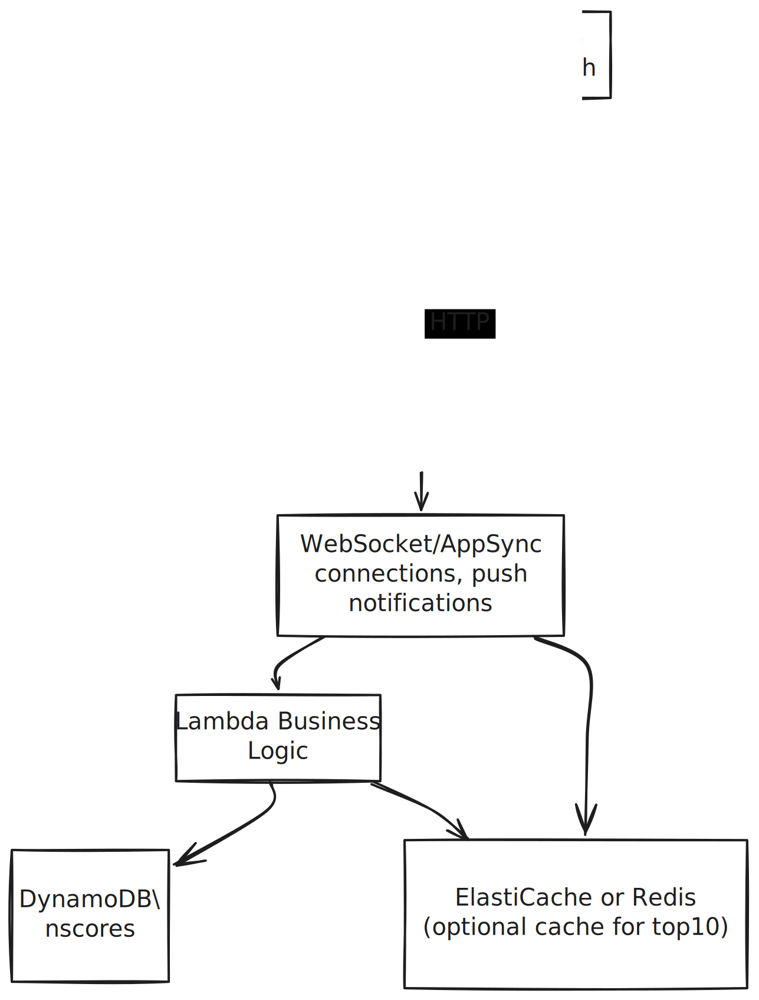

# Real-Time Scoreboard Update Module: AWS-Based System Design

---

## 1. Overview

This module manages a **Top 10** scoreboard for a website. When a user completes an action, it triggers an API call to update the user’s score. Updates must be **real-time**, **secure**, and **scalable**.
My assumption here is that the scoreboard is updated frequently, and the top 10 scores are displayed on the website. And **AWS** is the preferred cloud provider.

### High-Level AWS Components

1. **API Gateway (REST)**
    - Exposes endpoints such as `PATCH /score/update` and `GET /score/top10`.
    - Handles request validation, mapping, throttling, etc.

2. **Lambda Functions**
    - Contains the business logic (increasing user scores, computing top 10).
    - Invoked by API Gateway on requests.

3. **DynamoDB**
    - Stores user scores.
    - A suitable NoSQL solution for high concurrency and quick lookups/updates.

4. **ElastiCache (Redis)**
    - Optionally caches the top 10 scores in memory for fast retrieval.
    - Updated when any user’s score changes.

5. **API Gateway WebSocket / AppSync** (Real-Time Updates)
    - Pushes scoreboard updates to connected clients.
    - Could also use AWS AppSync (GraphQL) for subscriptions.

6. **Amazon Cognito** (or another auth method)
    - Manages user authentication (JWT tokens).
    - Ensures only legitimate requests can increment user scores.

---

## 2. Architecture Diagram (AWS-Oriented)

Refer to this: [Real-Time Scoreboard Update Architecture](https://excalidraw.com/#json=f_iqRiQNv0zdhzFkJYyAj,ZfFPdU5bym_-qizGMjO8uw)




### Flow Explanation

1. **Frontend (S3/CloudFront)**: The static site (scoreboard page) is hosted on Amazon S3 or served via CloudFront.
2. **User Auth via Cognito**: The user is authenticated, receiving JWT tokens for secure requests.
3. **Score Update** (`POST /score/update`):
   - **Browser** calls **API Gateway (REST)**, including the user’s auth token.
   - **API Gateway** invokes a **Lambda** function that:
      1. Validates the user and increment.
      2. Updates the user’s row in **DynamoDB**.
      3. Recomputes (or looks up) the **Top 10**—possibly from DynamoDB or a **Redis** cache.
      4. Pushes an update over WebSocket or AppSync to connected clients with the new scoreboard.
4. **Client** subscribed to **API Gateway WebSocket** or **AppSync** sees the updated scoreboard message in real time and updates the UI.

---

## 3. API Endpoints (AWS Gateway)

Below is a more AWS-specific outline:

1. **`POST /score/update`** (API Gateway - REST)
   - **Integration**: Lambda function `scoreUpdateHandler`.
   - **Request Payload**:
     ```json
     {
       "userId": "USER-123",
       "increment": 10
     }
     ```
   - **Auth**: Cognito JWT, validated by API Gateway authorizer or by Lambda.
   - **Lambda Logic**:
      1. Validate `userId` vs. token’s decoded body (to avoid mismatch).
      2. Increment the user’s score in DynamoDB.
      3. Optionally, re-calculate the top 10 and store it in Redis or DynamoDB.
      4. Push an update over WebSocket or AppSync to connected clients with the new top 10.
   - **Response**:
     ```json
     {
       "status": "success",
       "newScore": 50
     }
     ```

2. **`GET /score/top10`** (API Gateway - REST)
   - **Integration**: Lambda function `scoreTop10Handler`.
   - **Response**:
     ```json
     [
       { "userId": "USER-111", "score": 100 },
       { "userId": "USER-222", "score": 97 }
     ]
     ```
   - Optionally public or requires minimal auth (depending on security needs).

---

## 4. Real-Time Communication

### Option A: API Gateway WebSocket

- **Setup** a separate **API Gateway (WebSocket)** endpoint.
- Clients connect via WebSocket, subscribe to a “scoreboard” route.
- After each `POST /score/update`, the Lambda calls `@connections` endpoint in **API Gateway** to push a new scoreboard to all connected clients.

### Option B: AWS AppSync (GraphQL Subscriptions)

- **AppSync** automatically manages WebSocket connections for you.
- Define a **subscription** for scoreboard updates.
- When Lambda updates the scoreboard, it triggers a GraphQL subscription event.
- All subscribed clients get the updated scoreboard in real time.

---

## 5. Data Model (DynamoDB Example)

1. **Table**: `UserScores`
   - **Partition Key**: `userId` (string).
   - **Attributes**: `{ userId, score }`.
2. **Global Secondary Index** (GSI) for Top Scores:
   - **Partition Key**: a static value like `"SCOREBOARD"`.
   - **Sort Key**: `score` (or negative `score` to easily query top descending).
3. **Caching**: Use **Redis** in ElastiCache to store the top 10.
   - On each update, recalc or fetch from DynamoDB, then set in Redis: `top10 = [...]`.

---

## 6. Security & Authorization (AWS)

- **Cognito**:
   - Users authenticate via a **User Pool** or a **Federated Identity** provider.
   - The **JWT** is passed to API Gateway (REST or WebSocket).
   - Gateway uses a **Cognito Authorizer** or **Lambda Authorizer** to validate the token.
- **Lambda**: Double-check `userId` in the payload matches the subject in the token.
- **AWS WAF** (Web Application Firewall) if you want to block malicious requests at the edge.
- **CloudWatch Logs**: Keep logs of suspicious requests.
- **Rate Limiting**: Use API Gateway usage plans or concurrency limits on the Lambda to prevent spam.

---

## 7. Additional Comments / Improvements

1. **Scalability**:
   - DynamoDB + ElastiCache/Redis is a solid combo for high throughput.
   - Ensure table auto-scaling is configured if you anticipate spikes.
   - Use CloudFront for CDN and global distribution of the scoreboard site.

2. **Observability**:
   - Use **CloudWatch Metrics** and **X-Ray** for tracing.
   - Use **CloudWatch Logs** for Lambda and API Gateway logs.
   - Use **Sentry** or **CloudWatch Alarms** for error monitoring.
   - Monitor Lambda execution time, DynamoDB read/write capacity, and WebSocket connections.

3. **Testing**:
   - **Unit Tests** for each Lambda function (score update, top 10 retrieval).
   - **Integration Tests** with a test DynamoDB table or local DynamoDB - This can be done via a Docker image of the DynamoD in local
   - **E2E Tests** in a dev environment via cURL or Postman against the deployed API Gateway endpoints.

4. **Integration & Deployment**:
   - Infrastructure as Code with **AWS CloudFormation**, **CDK**, or **Terraform**.
   - CI/CD pipeline (e.g., GitHub Actions, AWS CodePipeline, Bitbucket CI/CD).

5. **Optional**:
   - Use **SQS** or **EventBridge** for asynchronous decoupling if the system grows in complexity.
   - Use **Step Functions** for orchestrating complex workflows.
   - Use K6 or Locust for load testing the system.

---

## 8. Conclusion

By leveraging AWS services like **API Gateway**, **Lambda**, and **DynamoDB** (with optional **ElastiCache** or **Redis**), we can build a **scalable** and **real-time** scoreboard update solution. AWS services simplify tasks like **authentication** (Cognito), **real-time updates** (WebSocket or AppSync), and **infrastructure management** (CloudFormation). The system satisfies:

1. **Live** scoreboard for top 10 users.
2. **Secure** updates of scores with Cognito/JWT verification.
3. **Fast** and **reliable** performance using DynamoDB + caching layer.
4. **Real-time notifications** via API Gateway WebSocket or AppSync subscriptions.

**Next Steps**:
- Implement the specification using IaC (AWS CDK or CloudFormation).
- Code the Lambda functions (`scoreUpdateHandler`, `scoreTop10Handler`) with DynamoDB integration.
- Set up the real-time channel (API Gateway WebSocket or AppSync).
- Deploy and test thoroughly in a dev or staging environment.
